<p align="center">
  
</p>

<div align="center" style="line-height: 1;">
  <a href="https://arxiv.org/abs/2412.20138" target="_blank"></a>
  <a href="https://discord.com/invite/hk9PGKShPK" target="_blank"></a>
  <a href="./assets/wechat.png" target="_blank"></a>
  <a href="https://x.com/TauricResearch" target="_blank"></a>
  <br>
  <a href="https://github.com/TauricResearch/" target="_blank"></a>
</div>

<div align="center">
  <!-- Keep these links. Translations will automatically update with the README. -->
  <a href="https://www.readme-i18n.com/TauricResearch/TradingAgents?lang=de">Deutsch</a> | 
  <a href="https://www.readme-i18n.com/TauricResearch/TradingAgents?lang=es">Español</a> | 
  <a href="https://www.readme-i18n.com/TauricResearch/TradingAgents?lang=fr">français</a> | 
  <a href="https://www.readme-i18n.com/TauricResearch/TradingAgents?lang=ja">日本語</a> | 
  <a href="https://www.readme-i18n.com/TauricResearch/TradingAgents?lang=ko">한국어</a> | 
  <a href="https://www.readme-i18n.com/TauricResearch/TradingAgents?lang=pt">Português</a> | 
  <a href="https://www.readme-i18n.com/TauricResearch/TradingAgents?lang=ru">Русский</a> | 
  <a href="https://www.readme-i18n.com/TauricResearch/TradingAgents?lang=zh">中文</a>
</div>

---

# TradingAgents: Multi-Agents LLM Financial Trading Framework

> **Fork note (CozyKim/TradingAgents):** 이 포크는 업스트림 CLI 위에 FastAPI 백엔드(`tradingagents_web/`)와 Next.js Toss 스타일 워크스페이스(`web/`)를 얹은 개인용 분석 워크벤치예요. 포트폴리오 모니터링, 관심종목, cron 기반 자동 분석, 알림(in-app + Telegram), 산업/섹터 분석, 분석 비교 뷰, PWA, SQLite 백업/복원을 함께 제공합니다. 셋업·운영 가이드는 [`DEV.md`](./DEV.md)에 정리해 두었습니다.

## Web Workspace (this fork)

> 아래 캡처는 모두 격리된 데모 DB(`scripts/seed_screenshots.py`)로 찍은 **더미 데이터**입니다. 매입가·평가액·시그널은 시드 스크립트가 만든 라운드 숫자라 실제 포지션과는 무관합니다.

<p align="center">
  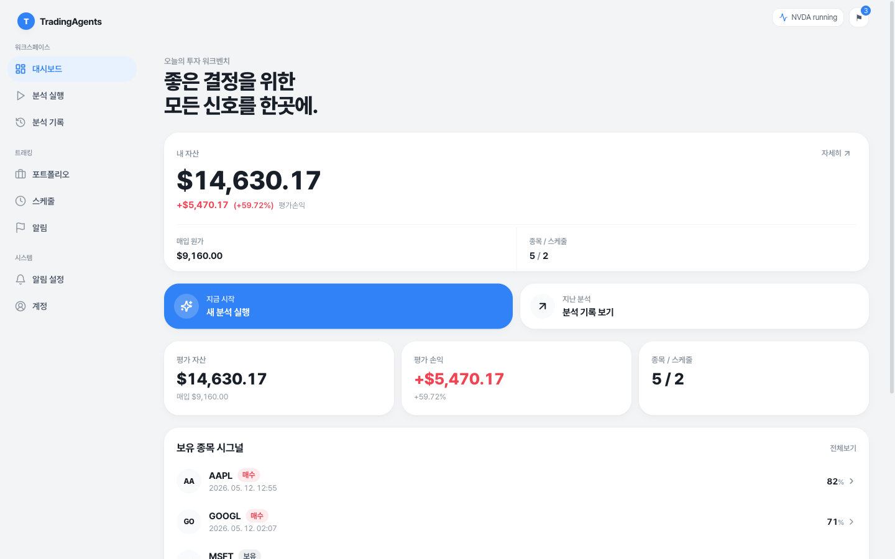
</p>

### Dashboard · Portfolio

평가액, 미실현 손익, 보유 종목 시그널, 진행 중인 분석을 한 화면에서 한눈에 볼 수 있어요. 보유 종목마다 평균 단가와 실시간 가격이 함께 표시되고, monitor 스위치를 켜 두면 평일 마감 30분 뒤 자동 분석 스케줄이 자동으로 생성됩니다.

<p align="center">
  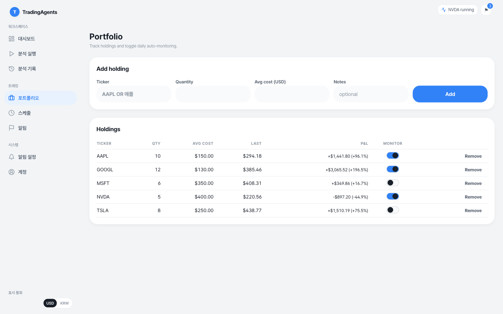
  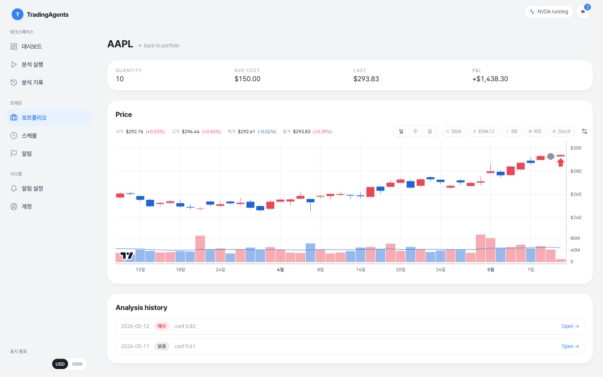
</p>

### Watchlist · 관심종목

스케줄에 등록된 모든 종목을 한곳에 모아 봅니다. 보유 종목 모니터링과 cron 예약으로 쌓인 티커가 자동으로 관심종목이 되고, 종목을 누르면 90일 캔들과 분석 히스토리가 있는 상세로 바로 이동해요(포트폴리오 보유 여부와 무관하게 추적 가능).

<p align="center">
  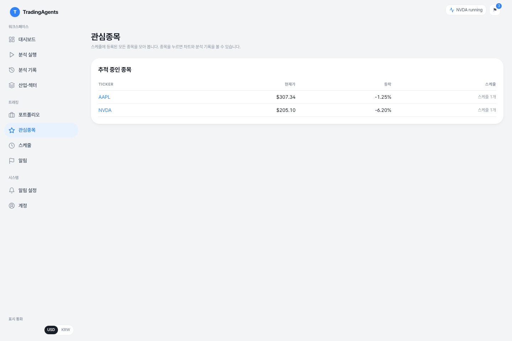
</p>

### Run · History · Compare

티커와 분석가(4종), 토론 라운드 수를 골라 분석을 실행하면 SSE로 phase별 진행 상황을 실시간으로 보여줍니다. 완료된 분석은 Market / Sentiment / News / Fundamentals 보고서로 정리되며, 두 건을 고르면 좌우로 나란히 비교할 수 있어요.

<p align="center">
  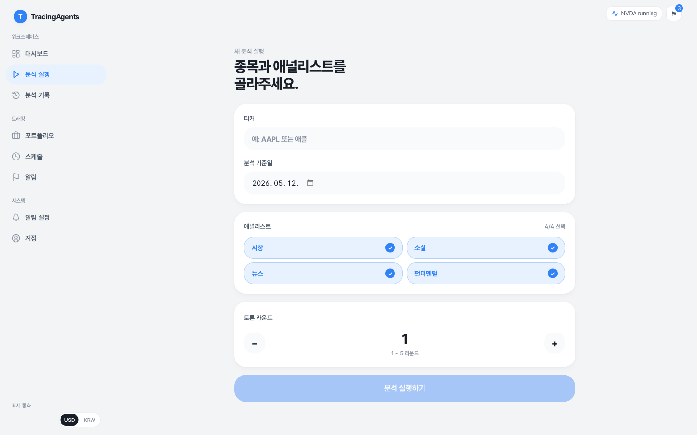
  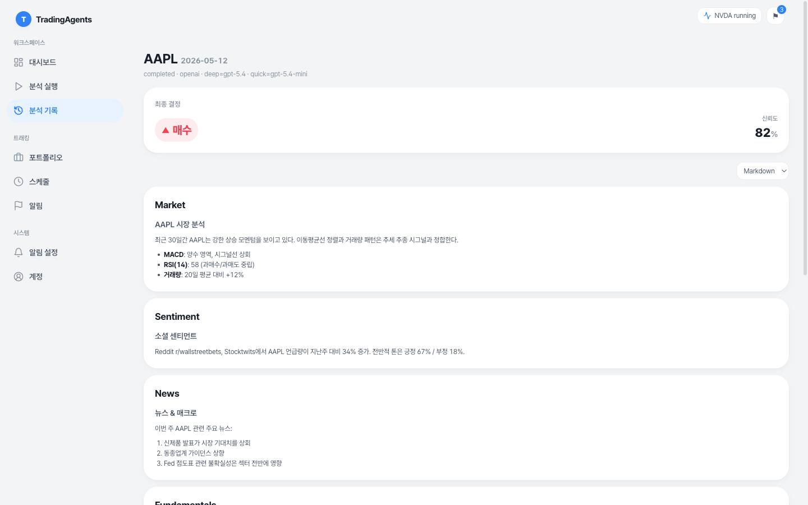
</p>

<p align="center">
  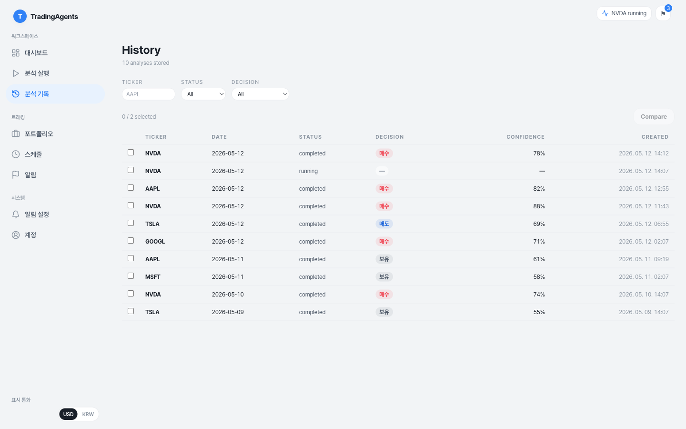
  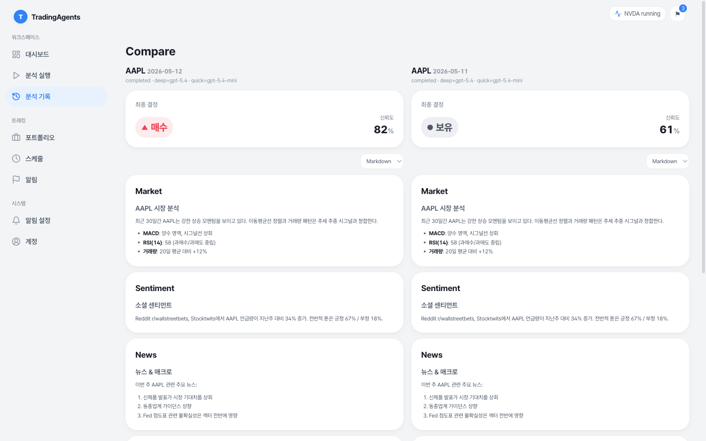
</p>

### 한국 종목 (KRX)

`.KS`(코스피)·`.KQ`(코스닥) 티커를 그대로 분석할 수 있어요. 한국 종목은 가격을 **원화로 인식·환산**해 표기하고(사이드바의 표시 통화 USD/KRW 토글), 소셜 감성 분석은 미국 종목의 Reddit/StockTwits 대신 **네이버 종목토론방**(기본 조회순)에서 의견을 수집합니다.

### Schedules · Alerts · Notifications

cron 식으로 자동 분석을 예약할 수 있어요. monitor가 켜진 보유 종목은 `source=holding`으로 자동 등록됩니다. 시그널이 바뀌거나 신뢰도가 임계값 이상 움직일 때, 또는 실행/스케줄이 실패할 때 in-app 알림과 Telegram 메시지가 함께 도착합니다. 트리거별 on/off와 임계값은 알림 설정 페이지에서 자유롭게 조정할 수 있어요.

<p align="center">
  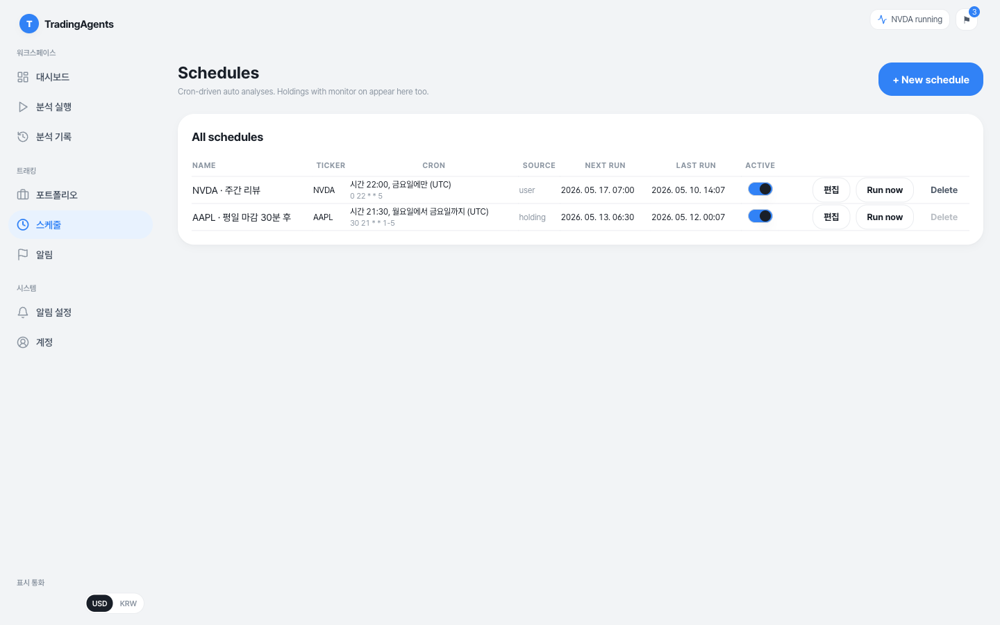
  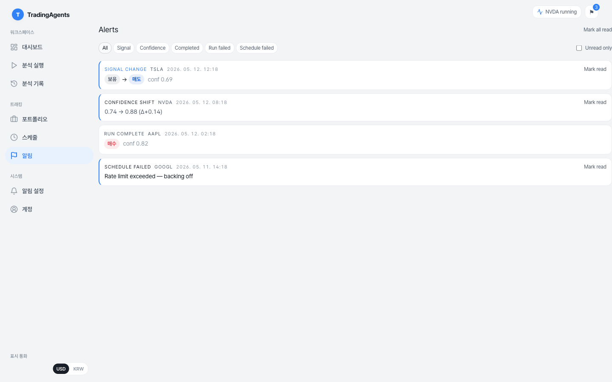
</p>

<p align="center">
  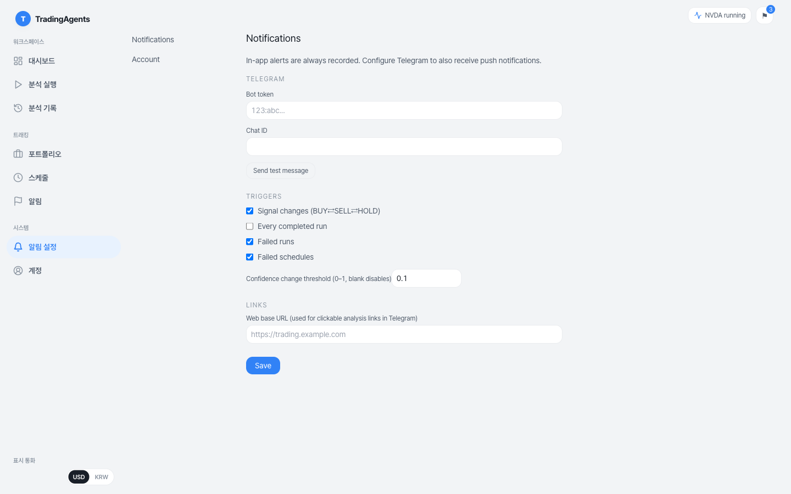
</p>

### Sectors — 산업/섹터 분석 (M6)

AI · 전력 · 반도체(메모리/비메모리) · 로봇 · 우주 같은 산업을 선택하면 4단계 LangGraph 그래프가 거시 환경 → 가치사슬 → 경쟁 구도 → 투자 전망 보고서를 생성합니다. 가치사슬은 mermaid 다이어그램, 단계별 기업 점유율은 **공시/추정/불명 배지 + 출처 URL**로 분리되어 어떤 수치가 어느 정도 신뢰할 수 있는지 한눈에 보입니다. 후보 종목 카드는 티커가 어느 시장(🇺🇸/🇰🇷) 소속인지 **마켓 배지**로 보여 주고, "종목 분석" 버튼이 기존 `/run` 폼으로 prefill되어 산업 → 종목 드릴다운이 자연스럽게 이어집니다.

<p align="center">
  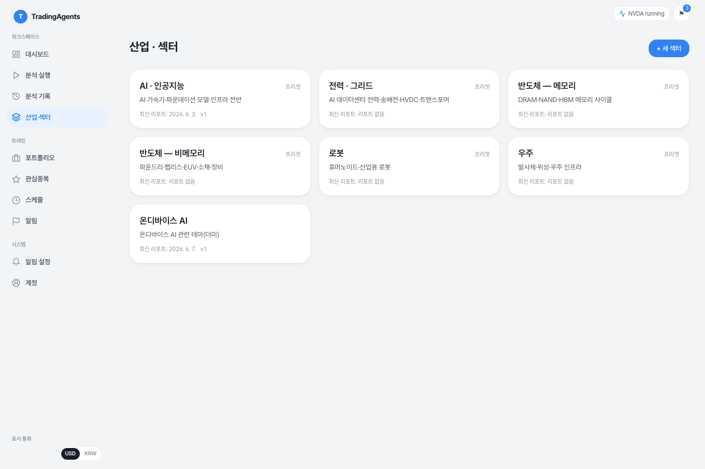
  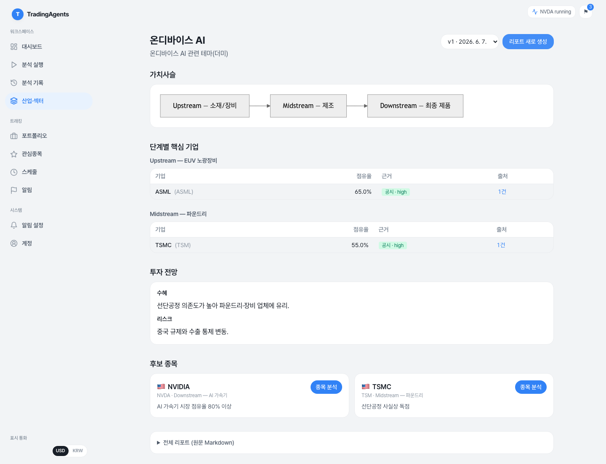
</p>

분석할 산업이 떠오르지 않으면 **"🔥 핫 섹터 추천받기"**로 한국·미국 커뮤니티와 최신 뉴스에서 뜨는 테마를 자동으로 발굴할 수 있어요. 스캔 결과는 핫니스 점수와 함께 카드로 제시되고 매번 버전으로 저장되어, **버전 선택기**로 과거 스캔을 다시 불러올 수 있습니다. 카드의 "이 섹터로 만들기"를 누르면 이름·키워드가 그대로 prefill됩니다.

<p align="center">
  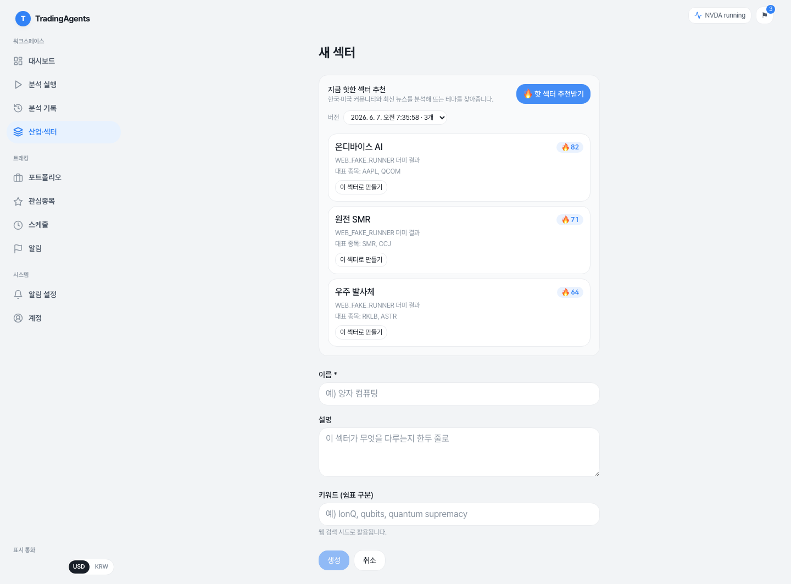
</p>

웹 검색은 Tavily(`TAVILY_API_KEY`)를 사용하며 노드당 3회·전체 12회 호출 가드로 비용 폭주를 막습니다. `WEB_FAKE_RUNNER=true`로 LLM/Tavily 호출 없이 흐름 검증 가능. 현재 실제 LLM 와이어링은 후속 작업으로 분리되어 있어 `WEB_FAKE_RUNNER`가 꺼진 상태에서 분석을 시작하면 명시적 503으로 거부됩니다(silent 실패 방지). 진행 중인 분석/스캔은 heartbeat로 생존 여부를 추적해 **정체(stall) 감지 시 경고와 취소 버튼**을 노출합니다.

### Mobile (installable PWA)

<p align="center">
  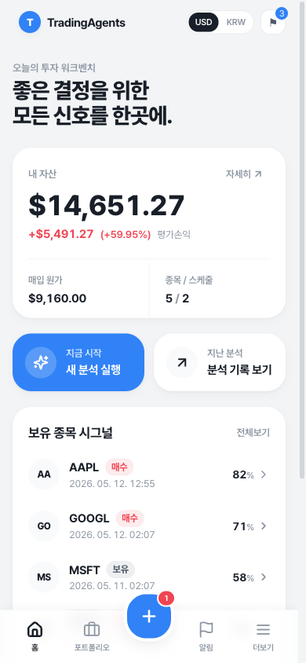
  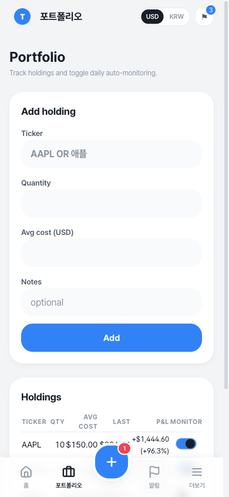
  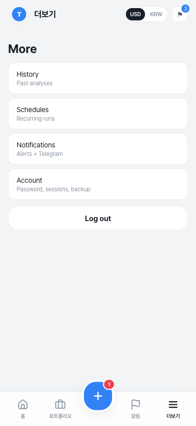
</p>

서비스 워커, 오프라인 fallback, 하단 탭바를 갖춘 설치형 PWA입니다. iOS Safari에서 `공유 → 홈 화면에 추가`로 설치하면 오프라인 상태에서도 캐시된 화면을 다시 열 수 있어요.

### 빠른 시작

```bash
uv sync                                   # Python 의존성
(cd web && npm install)                   # 프론트엔드 의존성
cp .env.example .env                      # secrets (DEV.md 참고)
uv run alembic upgrade head               # DB 마이그레이션
uv run tradingagents-web set-password     # 최초 비밀번호 설정
./dev.sh                                  # backend(8000) + web(3000) 동시 실행
```

Docker, Telegram 봇 연결, E2E 격리 DB, SQLite 백업·복원 같은 상세 가이드는 [`DEV.md`](./DEV.md)에 모아 두었습니다.

---

## News
- [2026-06] **Fork: 관심종목 · 트렌딩 섹터 · 한국 종목** — 스케줄 파생 관심종목 페이지, "핫 섹터 추천받기" 트렌딩 스캔 + 스캔 버전 관리, 섹터 진행 상황 stall 감지·취소, 후보 종목 마켓 배지, 한국 종목(`.KS`/`.KQ`) 원화 환산 및 네이버 종목토론방 감성 분석을 추가.
- [2026-05] **Fork: Toss-style UI rebrand** — 워크스페이스 전반(대시보드/포트폴리오/스케줄/알림)을 Toss 스타일로 리디자인하고 `TickerCombobox` 기반의 한글·영문 통합 티커 검색을 도입.
- [2026-04] **Fork: Web app M2 → M5** — FastAPI + Next.js 14 워크스페이스 추가. M2 Run/History(SSE 진행 표시), M3 Portfolio + APScheduler cron 자동 분석, M4 Alerts(in-app + Telegram), M5 Polish(PWA, History 비교 뷰, Account 백업/복원).
- [2026-03] **TradingAgents v0.2.3** released with multi-language support, GPT-5.4 family models, unified model catalog, backtesting date fidelity, and proxy support.
- [2026-03] **TradingAgents v0.2.2** released with GPT-5.4/Gemini 3.1/Claude 4.6 model coverage, five-tier rating scale, OpenAI Responses API, Anthropic effort control, and cross-platform stability.
- [2026-02] **TradingAgents v0.2.0** released with multi-provider LLM support (GPT-5.x, Gemini 3.x, Claude 4.x, Grok 4.x) and improved system architecture.
- [2026-01] **Trading-R1** [Technical Report](https://arxiv.org/abs/2509.11420) released, with [Terminal](https://github.com/TauricResearch/Trading-R1) expected to land soon.

<div align="center">
<a href="https://www.star-history.com/#TauricResearch/TradingAgents&Date">
 <picture>
   <source media="(prefers-color-scheme: dark)" srcset="https://api.star-history.com/svg?repos=TauricResearch/TradingAgents&type=Date&theme=dark" />
   <source media="(prefers-color-scheme: light)" srcset="https://api.star-history.com/svg?repos=TauricResearch/TradingAgents&type=Date" />
   
 </picture>
</a>
</div>

> 🎉 **TradingAgents** officially released! We have received numerous inquiries about the work, and we would like to express our thanks for the enthusiasm in our community.
>
> So we decided to fully open-source the framework. Looking forward to building impactful projects with you!

<div align="center">

🚀 [TradingAgents](#tradingagents-framework) | ⚡ [Installation & CLI](#installation-and-cli) | 🎬 [Demo](https://www.youtube.com/watch?v=90gr5lwjIho) | 📦 [Package Usage](#tradingagents-package) | 🤝 [Contributing](#contributing) | 📄 [Citation](#citation)

</div>

## TradingAgents Framework

TradingAgents is a multi-agent trading framework that mirrors the dynamics of real-world trading firms. By deploying specialized LLM-powered agents: from fundamental analysts, sentiment experts, and technical analysts, to trader, risk management team, the platform collaboratively evaluates market conditions and informs trading decisions. Moreover, these agents engage in dynamic discussions to pinpoint the optimal strategy.

<p align="center">
  
</p>

> TradingAgents framework is designed for research purposes. Trading performance may vary based on many factors, including the chosen backbone language models, model temperature, trading periods, the quality of data, and other non-deterministic factors. [It is not intended as financial, investment, or trading advice.](https://tauric.ai/disclaimer/)

Our framework decomposes complex trading tasks into specialized roles. This ensures the system achieves a robust, scalable approach to market analysis and decision-making.

### Analyst Team
- Fundamentals Analyst: Evaluates company financials and performance metrics, identifying intrinsic values and potential red flags.
- Sentiment Analyst: Analyzes social media and public sentiment using sentiment scoring algorithms to gauge short-term market mood.
- News Analyst: Monitors global news and macroeconomic indicators, interpreting the impact of events on market conditions.
- Technical Analyst: Utilizes technical indicators (like MACD and RSI) to detect trading patterns and forecast price movements.

<p align="center">
  
</p>

### Researcher Team
- Comprises both bullish and bearish researchers who critically assess the insights provided by the Analyst Team. Through structured debates, they balance potential gains against inherent risks.

<p align="center">
  
</p>

### Trader Agent
- Composes reports from the analysts and researchers to make informed trading decisions. It determines the timing and magnitude of trades based on comprehensive market insights.

<p align="center">
  
</p>

### Risk Management and Portfolio Manager
- Continuously evaluates portfolio risk by assessing market volatility, liquidity, and other risk factors. The risk management team evaluates and adjusts trading strategies, providing assessment reports to the Portfolio Manager for final decision.
- The Portfolio Manager approves/rejects the transaction proposal. If approved, the order will be sent to the simulated exchange and executed.

<p align="center">
  
</p>

## Installation and CLI

### Installation

Clone TradingAgents:
```bash
git clone https://github.com/TauricResearch/TradingAgents.git
cd TradingAgents
```

Create a virtual environment in any of your favorite environment managers:
```bash
conda create -n tradingagents python=3.13
conda activate tradingagents
```

Install the package and its dependencies:
```bash
pip install .
```

또는 `uv`를 사용하는 경우 (이 포크의 권장 방식, `pyproject.toml` + `uv.lock` 동기화):
```bash
uv sync                           # 의존성 설치 (.venv 자동 생성)
uv run tradingagents              # CLI 실행
uv run alembic upgrade head       # 웹 앱 사용 시 DB 마이그레이션
```
웹 앱 셋업·실행 흐름은 [`DEV.md`](./DEV.md) 참조.

### Docker

Alternatively, run with Docker:
```bash
cp .env.example .env  # add your API keys
docker compose run --rm tradingagents
```

For local models with Ollama:
```bash
docker compose --profile ollama run --rm tradingagents-ollama
```

### Required APIs

TradingAgents supports multiple LLM providers. Set the API key for your chosen provider:

```bash
export OPENAI_API_KEY=...          # OpenAI (GPT)
export GOOGLE_API_KEY=...          # Google (Gemini)
export ANTHROPIC_API_KEY=...       # Anthropic (Claude)
export XAI_API_KEY=...             # xAI (Grok)
export DEEPSEEK_API_KEY=...        # DeepSeek
export DASHSCOPE_API_KEY=...       # Qwen (Alibaba DashScope)
export ZHIPU_API_KEY=...           # GLM (Zhipu)
export OPENROUTER_API_KEY=...      # OpenRouter
export ALPHA_VANTAGE_API_KEY=...   # Alpha Vantage
```

Codex OAuth is also available for local, single-user research workflows using a ChatGPT Plus/Pro account with Codex access. This provider uses the ChatGPT/Codex consumer backend rather than the public OpenAI API, so it does not require `OPENAI_API_KEY` and is not intended for production or multi-user hosting.

```bash
python -m tradingagents.llm_clients.codex_oauth login
# If the browser callback port is unavailable:
python -m tradingagents.llm_clients.codex_oauth login --manual
```

For enterprise providers (e.g. Azure OpenAI, AWS Bedrock), copy `.env.enterprise.example` to `.env.enterprise` and fill in your credentials.

For local models, configure Ollama with `llm_provider: "ollama"` in your config.

Alternatively, copy `.env.example` to `.env` and fill in your keys:
```bash
cp .env.example .env
```

### CLI Usage

Launch the interactive CLI:
```bash
tradingagents          # installed command
python -m cli.main     # alternative: run directly from source
```
You will see a screen where you can select your desired tickers, analysis date, LLM provider, research depth, and more.

<p align="center">
  
</p>

An interface will appear showing results as they load, letting you track the agent's progress as it runs.

<p align="center">
  
</p>

<p align="center">
  
</p>

## TradingAgents Package

### Implementation Details

We built TradingAgents with LangGraph to ensure flexibility and modularity. The framework supports multiple LLM providers: OpenAI, Google, Anthropic, xAI, OpenRouter, and Ollama.

### Python Usage

To use TradingAgents inside your code, you can import the `tradingagents` module and initialize a `TradingAgentsGraph()` object. The `.propagate()` function will return a decision. You can run `main.py`, here's also a quick example:

```python
from tradingagents.graph.trading_graph import TradingAgentsGraph
from tradingagents.default_config import DEFAULT_CONFIG

ta = TradingAgentsGraph(debug=True, config=DEFAULT_CONFIG.copy())

# forward propagate
_, decision = ta.propagate("NVDA", "2026-01-15")
print(decision)
```

You can also adjust the default configuration to set your own choice of LLMs, debate rounds, etc.

```python
from tradingagents.graph.trading_graph import TradingAgentsGraph
from tradingagents.default_config import DEFAULT_CONFIG

config = DEFAULT_CONFIG.copy()
config["llm_provider"] = "openai"        # openai, codex_oauth, google, anthropic, xai, openrouter, ollama
config["deep_think_llm"] = "gpt-5.4"     # Model for complex reasoning
config["quick_think_llm"] = "gpt-5.4-mini" # Model for quick tasks
config["max_debate_rounds"] = 2

ta = TradingAgentsGraph(debug=True, config=config)
_, decision = ta.propagate("NVDA", "2026-01-15")
print(decision)
```

For Codex OAuth:

```python
config["llm_provider"] = "codex_oauth"
config["deep_think_llm"] = "gpt-5.5"
config["quick_think_llm"] = "gpt-5.4-mini"
```

See `tradingagents/default_config.py` for all configuration options.

## Contributing

We welcome contributions from the community! Whether it's fixing a bug, improving documentation, or suggesting a new feature, your input helps make this project better. If you are interested in this line of research, please consider joining our open-source financial AI research community [Tauric Research](https://tauric.ai/).

## Citation

Please reference our work if you find *TradingAgents* provides you with some help :)

```
@misc{xiao2025tradingagentsmultiagentsllmfinancial,
      title={TradingAgents: Multi-Agents LLM Financial Trading Framework}, 
      author={Yijia Xiao and Edward Sun and Di Luo and Wei Wang},
      year={2025},
      eprint={2412.20138},
      archivePrefix={arXiv},
      primaryClass={q-fin.TR},
      url={https://arxiv.org/abs/2412.20138}, 
}
```
